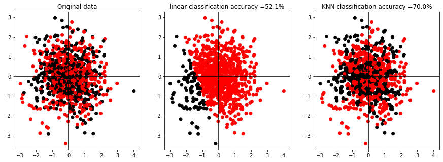

# Credit Score Assessment using AI CEDAR-ROSE
## Introduction
Any company seeking a loan must demonstrate its ability to pay back the principal and interest.
Lenders often evaluate credit risk using profitability and leverage.
Profitable businesses produce enough income to pay interest and principal.
Leveraged firms have less equity to withstand economic shocks.
Which of the two loan applicants has the lowest credit risk?
This issue becomes much more difficult to answer when banks factor in other aspects of credit risk assessment.
They may be financial (like liquidity ratio) or behavioral (like loan/trade credit payment habit).
Combine all of these characteristics into one score is difficult, but machine learning can help. 
<br>
__But How?__
<br>
Machine learning and conventional statistical learning techniques both aim to learn from data.
Both methods use a training dataset to explore underlying connections.
However, machine learning may learn from data without any rules-based programming.
This flexibility allows machine learning techniques to match data patterns. 
__for illustration, let's take a look at the following example:__
- Building data
According to the __CLT__ _Centerla limit theorem_ the independent variables tends towards the normal distribution. 
The following data points were created randomly two independent variables from a normal distribution and binary target data representing classification decisions similar to __\[lend or not\]__.  


```python
import numpy as np
import matplotlib.pyplot as plt
import matplotlib as mpl

np.random.seed(24)
x = np.random.normal(0,1,1000)
y = np.random.normal(0,1,1000)
targets = np.random.choice(2,1000,1)
cmap = (mpl.colors.ListedColormap(['k', 'r']))
fig, (ax1,ax2,ax3) = plt.subplots(1,3)
fig.set_figheight(5)
fig.set_figwidth(15)
ax1.scatter(x,y,c= targets,cmap=cmap)
ax1.axhline(y=0, color='k')
ax1.axvline(x=0, color='k')
ax1.set_title(f'Original data')
#----------Linear classification--------------
from sklearn.linear_model import LinearRegression
lr = LinearRegression()
data = np.array([np.array(x) for x in zip(x,y)])
lr.fit(data,targets)
linear_predictions = lr.predict(data)
linear_predictions = [round(x) for x in linear_predictions ]
def accuracy(true,pred):
    t = 0
    for x in range(len(true)):
        if true[x] == pred[x]:
            t +=1
    return t/len(true)            
socore = accuracy(targets,linear_predictions)
ax2.scatter(x,y,c=linear_predictions,cmap=cmap,label=f'linear classification f1={socore}')
ax2.axhline(y=0, color='k')
ax2.axvline(x=0, color='k')
ax2.set_title(f'linear classification accuracy ={socore *100 }%')
#-----------------Non-linear classification-----------
from sklearn.neighbors import KNeighborsClassifier
clf = KNeighborsClassifier()
clf.fit(data,targets)
nonlinear_prediction = clf.predict(data)
def accuracy(true,pred):
    t = 0
    for x in range(len(true)):
        if true[x] == pred[x]:
            t +=1
    return t/len(true)            
socore = accuracy(targets,nonlinear_prediction)
ax3.scatter(x,y,c=nonlinear_prediction,cmap=cmap)
ax3.axhline(y=0, color='k')
ax3.axvline(x=0, color='k')
ax3.set_title(f'KNN classification accuracy ={round(socore,2) *100 }%');
```





 - Using statistical approach for such data is quite difficult as there is no linear that can distinguish between the two classes without huge error as shown below. 

- With the non-linear classifiers we can predict the data with more accuracy as shown in the above figure.

## Applying AI process 
Predictive analytics solutions are more frequently than not used in conjunction with artificial intelligence solutions for credit rating.
This makes sense considering that credit ratings are essentially predictions of a customer's ability to repay their debts. 


### There are two main ways to implement AI for credit scoring. 


- Using a Machine learning model. 
- Using a Natural language processing model.


#### Which way to go is heavily influenced by the data available for example:


- For Textual data that describes the company's situation or economic news can be used in an NLP model which will give better accuracy than standard machine learning models. 
- However, if the data available are numerical or categorical then statistics and machine learning can be the best solution since it requires fewer resources to manage unlike the deep learning and Natual Language models which have millions of parameters and requires terabytes of data to train. 
- Recently pre-trained models evolved into models that outperform machine learning in all tasks and use much lesser data as it's pretrained on a huge corpus of data scraped from the internet and it proved its ability to generalize on the unseen data and capture patterns. 
- The only problem with such models is that are big and need bigger machines to run them, thus cloud solutions are used in these cases. 
- However, there are new optimization methods that can improve these models' complexity such as the distillation and the GAN. 


### The Main process of applying AI into credit score business 


_The main process of the implementation of machine learning can be summarized into the following steps:_

1. __Collecting data__:Whether the data is written on paper, recorded in text files and spreadsheets, or stored in an SQL database, you will need to gather it in an electronic format suitable for analysis. This data will serve as the learning material an algorithm uses to generate actionable knowledge.

2. __Exploring and preparing the data__: The quality of any machine learning project is based largely on the quality of data it uses. This step in the machine learning process tends to require a great deal of human intervention. An often-cited statistic suggests that 80 percent of the effort in machine learning is devoted to data. Much of this time is spent learning more about the data and its nuances during a practice called data exploration.

3. __Training a model on the data__: By the time the data has been prepared for analysis, you are likely to have a sense of what you are hoping to learn from the data. The specific machine learning task will inform the selection of an appropriate algorithm, and the algorithm will represent the data in the form of a model.

4. __Evaluating model performance__: Because each machine learning model results in a biased solution to the learning problem, it is important to evaluate how well the algorithm learned from its experience. Depending on the type of model used, you might be able to evaluate the accuracy of the model using a test dataset, or you may need to develop measures of performance specific to the intended application.

5. __Improving model performance__: If better performance is needed, it becomes necessary to utilize more advanced strategies to augment the performance of the model. Sometimes, it may be necessary to switch to a different type of model altogether. You may need to supplement your data with additional data or perform additional preparatory work as in step two of this process.


##  CEDAR ROSE CR SCORE 

In this section, we will explain the machine learning implementation steps using Python libraries in as detail as possible. 

###  1. Data Collection

The data can come from multiple sources _1)_ inside a database which can be stored in a form of __SQL__ or __NoSQL__
or other forms of data. _2)_ or form outsource such as web scraping or APIs. 

- For __SQL__ in python they are libraries such as [SQLAlchamy](https://www.sqlalchemy.org/) in this library some classes allow us to connect to any SQL database and using SQL queries for mining our data. 
- For no __NoSQL__ the library that can manage [mongodb](https://www.mongodb.com/) database is called [pymongo](https://pymongo.readthedocs.io/en/stable/)  this library allows the connection with MongoDB and it can work with BISON data the original language of MongoDB into JSON form that can bed used easily by the [json](https://docs.python.org/3/library/json.html) library in python. 
- For web scrapping the library [beautiful soap]() is able to scrap HTML files from the web and return the results in HTML structure where we can get the information using tags ```<h1>``` or ids ```<a  id="link1">data</a>```
- If we have APIs the most common library to handle API requests and returns is the [requests](https://docs.python-requests.org/en/master/) library. 

After we successfully collected our data we need to understand what are the data types that we are dealing with.

The data can be structured or  Textual

#### Structured Data. 

The structured data is usually stored in an SQL database in tabular forms with Columns represents attributes and rows represents data instances. The data can be qualitative or quantitative. If qualitative it can be nominal or ordinal. If quantitative it can be discrete or continuous.

###### Qualitative vs Quantitative Data

- __Quantitative data__
Quantitative data can be expressed as a number or can be quantified. Simply put, it can be measured by numerical variables.
- __Qualitative data__
Qualitative data can answer questions such as “how this has happened” or and “why this has happened”.
Qualitative data is also called categorical data because the information can be sorted by category, not by number.


###### Nominal vs Ordinal Data
- __Nominal__
Nominal data is used just for labeling variables, without any type of quantitative value. The name ‘nominal’ comes from the Latin word “nomen” which means ‘name’.
- __Ordinal__
Ordinal data is data that is placed into some kind of order by their position on a scale. Ordinal data may indicate superiority.
###### Discrete vs Continuous Data
- __Discrete data__
Discrete data is a count that involves only integers. The discrete values cannot be subdivided into parts.
- __Continuous data__
Continuous data is information that could be meaningfully divided into finer levels. It can be measured on a scale or continuum and can have almost any numeric value.

Example form the data provided by __Ceder Rose__ the Categorical data such as 
1. __The register table__

|Organisation| Register| Type| Number| Issue Date| Expiry Date |Status|
|---|---|---|---|---|---|---|
|nominal|nominal|nominal|nominal|Ordinal|Ordinal|nominal|

All represent Nominal data the gives nor order except for the issuing & expiry dates which considered ordinal data
2. __LEGAL ENTITY AFFILIATION HIERARCHY table__

|Name| Country| UBO| Status|% Of Ownership(Direct & Indirect)|Shares Value| Level Of Ownership|Update Date|
|---|---|---|---|---|---|---|---|
|nominal|nominal|nominal|nominal|continuous|continuous|ordinal|Ordinal|

3. __Number of employees over time__ 

|Year|Number of emplyoees|
|---|---|
|ordinal|discrete|

4. __The Financial statements__ 

The financial statements including balance sheet cash flow and income statements provide a lot of useful information about the customer. 
Three main values can be extracted from the three financial statements 

__Assets vs liabilities, liquidity, and performance.__

Most of these data are summarized in the key performance indicators that can be used in the analysis to reduce the data dimensionality and provide the model with much more meaningful inputs. 

#### Textual data 

This is where we use the Natural language processing power data such as __company's profile__, __Comments__, and __ECONOMIC AND POLITICAL OVERVIEW__ can be used in our NLP models. 
luckily in python parsing text is natively implemented alternatively we can use [RUST](https://www.rust-lang.org/learn) for efficiency. 

#### How python handles this data 

Importing and manipulating the data can be handled best by [Pandas](https://pandas.pydata.org/)library. This library storing the data in the memory as a data frame object allowing vectorization or optimal speed. 


## 2. Exploring and preparing the data aka "Data preprocessing "

### Importing the data 

Importing the data in our code is the first step in our preprocessing libraries such as pandas can handle multiple types of data storage such (CSV, TSB, Excel, XML, JSON, text, HTML,...) those. 
However, if we are working with SQL databases or other connectable sources we are going to import our data using an established connection. From SQLAlchemy or Pymongo which returns data type dictionary.

### Importing libraries 

Most common used libraries for data exploration and data visualiztion [pandas], [numpy](https://numpy.org/) for math and array operation, [scipy](https://www.scipy.org/scipylib/) for numerical integration, interpolation, optimization, linear algebra, and statistics.[matplotlib](https://matplotlib.org/) and [seaborn](https://seaborn.pydata.org) for data visualization

### Determining the Features and performing feature importance. 

The features are the data attributes that can be in a form of columns or a token in a text. 

performing the feature importance for structured data can be handled by the library such as scikit-learn which we will include a lot in this process. 

### Identifying and handling the missing values 

__Data preprocessing__ Consists for two main concepts __Data Validation__ and __Data Imputation__
- __Data Validation__ the validation process is to make sure that the data is complete, accurate, secure, and consistent.
- __Data imputation__ referring to handling the missing data. 

"Missing values" may be present in the majority of real-world datasets.
Blanks or other placeholders are often used instead of NaNs, blanks, or zero-length strings.
The quality of the machine learning model may be significantly impacted if the dataset used to train it contains many missing values.

Getting rid of observations with incomplete data is one approach to solving this issue.
That said, you are risking the loss of important data points.
In this case, imputing the missing values would be a preferable approach.
To put it another way, we need to assume the missing values to apply the available portion of the data. 

__Using ( Mean / Mendian / Mod )__

The three types of "averages" are called "mean", "median", and "mode".
Statistics often provide an "average" result, although there are only three of these that are the most frequent.

1. __mean__ In many cases, people consider the mean to be average, and then they add up all the numbers and divide by the count of numbers.
$\\ \newline \\ \hat{x} = \frac{\sum{x_i}}{N} \newline \\ $
2. __median__ In a list of numbers, the "median" (sometimes known as the "central value") is the value that divides the list in half. You must have to reorder your data before you can discover the median.
$\newline 
[X] \rightarrow \ is \ a \ sorted \ list \\ 
n \rightarrow \ is \ the \ count \ of \ [X]
\\
when \ n \ is \ odd \ \hat{x} = [X][\frac{n+1}{2}] 
\\
when \ n \ is \ even \ \hat{x} = \frac{[X][\frac{n}{2}-1] + [X][\frac{n}{2}+1]}{2}
\newline $

3. __mode__ The "mode" is the value that happens most often. If no number appears more than once in the list, there is no way to describe the list's possible modes. 
$
\hat{x} = l + h(\frac{f_m - f_1}{2 f_m - f_1 - f_2})
\\ l \rightarrow \ is \ the \ lower \ boundry 
\\ h \rightarrow \ the \ size
\\ f_m \rightarrow \ is \ the \ frequency \ corresponding 
\\ f_1 \rightarrow \ is \ the \ frequency \ preceding
\\ f_2 \rightarrow \ is \ the \ frequency \ proceeding
$


let's consider a list of 10 numbers ```[1,1,2,5,5,2,1,5,4,10]``` for this list the follwing is calculated 
- __Mean__  $ \ = \ \frac{36}{10} = \ 3.6 $ This value is the sum divided by the count and don't represents a real value in the list considered above. 
- __Median__ $ sort([X]) \rightarrow [1,1,1,2,2,4,5,5,5,10] \\ \hat{x} = \frac{[X][\frac{10}{2}-1 ] + [X][\frac{10}{2}+1 ]}{2} = \frac{2+4}{2} = 3 $
- __Mode__ calculating the max frequency for each unique value is 3 the frequency table shows there are 2 modes in this list (1,5). 

|frequency |item|
|---|---|
|   __3__|__1__ |
|     2 |    2|
|     __3__  |   __5__|
|1|4|
|     1   | 10|


__Replacing with constnt__

The missing data can be replaced by zero or any other desired input this approaches depends on the domain knowledge and how important this feature is we determined this in the step of features importance. 

__Replacing with most frequent category__
Like mode bur for categorical data. 

__Unsupervised machine learning appraoch__
Using algorithms such as KNN to determining the missing value based on the nearest neighbors. 

### Dimentionality reduction 

After importing the data and handling all the missing values it's very important. 
The common method for the Dimentinality reductions are 

1. Principal component analysis(PCA)
2. Backword elimination using correlation and p-value. 
2. Generalized discriminant analysis (GDA)

most of them are handled by python native and sciketlearn library

### Encoding the categorical data

Machine Learning models are built on equations.
Thus, retaining categorical data in the equation will create problems because equations only require numbers. 

1. Handling Nominal data 

The way to handle the nominal data is by using the __one hot encoding__ this can be used from the [Pandas] library or [scikit-learn](https://scikit-learn.org/stable/) library. This process transforms the data into one hot encoded \[0s,1\] for example if we have categories in one of our features such as status such as \[active,not-active\] it can be transformed into two features \[status-active,status-not-active\] and the value for each feature is \[0,1\] and this can apply as many features however if the categories are too many applying one hot encoding method will result in a sparse matrix. instead, we can use methods such as the bag of word method or handling data as textual if it is longer. 

2. Handling ordinal data 

Most of the ordinal data provided were dates. python can handle date and time using [Datetime](https://docs.python.org/3/library/datetime.html) library. For ranking, we can use a count vectorizer from the scikit-learn library. 

3. Handling textual data. 

The following methods can handle textual data which too large that can't be encoded as one-hot encoding. 

- Index-Based Encoding can be done using python dictionaries 

- Bag of Words (BOW) using  [sklearn]

- TF-IDF Encoding using [sklearn] as well

- Word2Vector Encoding using  using [nltk](https://www.nltk.org/), [gensim](https://radimrehurek.com/gensim/gensim_numfocus/auto_examples/core/run_core_concepts.html), and [stanford nlp](https://stanfordnlp.github.io/stanfordnlp/) libraries

- BERT Encoding using [hugging face]() library
    
- BPE Byte Pairs encoding. [hugging face]


## 3. Training a model on the data

Multiple models can provide us decisions regarding our CR score return 

My approach regarding the report provided will be returning a score as a regression task based on the data we have collected about the company. 

There are main steps to Train and maintain a model 

1. creating a pipeline 

After we successfully transformed our data into the desired input for the mathematical models. We need to create a pip function that will transform the raw data into our desired input.

For structured data, we can rely on the sci-kit learn library 
on the textual data nltk, gensim or Stanford will serve us well. 

2. choosing the model 

    - Machine Learning.
        - supervised  there are many supervised machine learning algorithms such SVM, naive bayse, or decision tree using a different model and compare is one approach that we can use, however, we can implement bagging with different models there
        - Unsupervised the unsupervised technique can be using the LDA algorithm, performing cosine similarity, or implement the LSH algorithm. 

    - Deep learning. 
        - As we can collect time-series data using LSTM Algorithm based on Recurrent neural network as it is still the state of the art in data series analysis we can build the library using [keras](), [tensorflow](), [pytorch]() libraries.
        - For textual data, we can use BERT and Transformer based model using [hagging face]() library. 
    
3. Training the model 

Before Training the model we must assess our resources from memory, GPU availability, processing power in CPU, and finally data storage. 

Then the training can be done sequentially or parallelly. 

Based on the resources and time available.

for the RNN model, it can't be trained parallel as the algorithm learn based on a sequential step in time. 


## 4. Model evaluation 

_After training there are two main ways to report the model that was trained._ 

   - Hold out method
   - Cross-validation method 

_For model evaluation we are assessing the time of inference with the performance._ 

- For the time of interference it is important to be minimized as it means a delay in the results and it can be and turn off to an online application for instance. 

- For the model performance there are metrics depending on the task on hand
    - __Classification metrics__ 
        - Classification Accuracy
        - Confusion matrix
        - Logarithmic Loss
        - Area under curve (AUC)
        - F-Measure
    - __Regression metrics__ 
        - MSE
        - RMSE

## 5. Improving Model performance 

How to improve our model is a consistent process performed with the following actions. 
1. Improving the Quality of the data 
2. increasing the Quantity of the data 
3. Tunning hyperparameters of the model used 
4. Changing the model exploring more options. 
